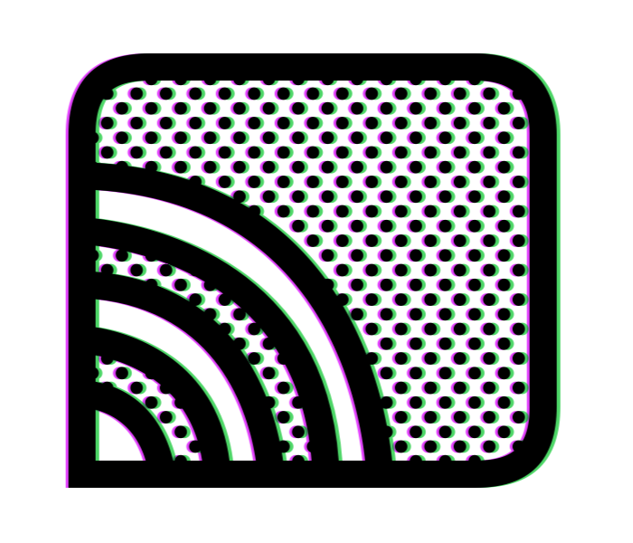

  

Websocket Broadcast (aka ws-broadcast)
================================

This module provides a zero config (if you want it to) websocket server. It can be used as an CLI or as a node module.

It is based on code used throughout several prototypes we build here at [IXDS](https://www.ixds.com/).

## Installation

install it like this:

```shell
npm install @ixds/ws-broadcast
```

Or as global cli (not recommended):

```shell
npm install -g @ixds/ws-broadcast
```


## Usage CLI

You can run this as a CLI in package.json or as a global tool

In the shell:

```shell
ws-broadcast --help

  Usage: ws-broadcast [options]

  Options:

    -V, --version          output the version number
    -c, --config <config>  path to your config.json file
    -h, --help             output usage information
```

If no config file is provided it will use the default configuration.

```json
{
    "host": "0.0.0.0",
    "port": 3334,
    "backlog": null,
    "path": null,
    "noServer": false,
    "clientTracking": true,
    "perMessageDeflate": false,
    "maxPayload": 104857600,
    "exclusiveBroadcast": false
}

```
For even more configuration see the api docs of [websockets/ws: Simple to use, blazing fast and thoroughly tested WebSocket client and server for Node.js](https://github.com/websockets/ws/blob/master/doc/ws.md).


In `package.json` you can provide a script like this.

```json
{
  "scripts": {
    "ws-server": "./node_modules/.bin/ws-broadcast -c \"./path/to/your/config.json\""
  }
}
```

Or even shorter:

```json
{
  "scripts": {
    "ws-server": "ws-broadcast -c \"./path/to/your/config.json\""
  }
}
```

If the default config is fine for you it could also be:

```json
{
  "scripts": {
    "ws-server": "ws-broadcast"
  }
}
```

## Usage as Module

```js
const {wsBroadcast} = require('ws-broadcast');
const path = require('path');
const wss = wsBroadcast();
// now do additional things with wss
```

With config passed to the module.

```js
const {wsBroadcast} = require('ws-broadcast');
const path = require('path');
const wss = wsBroadcast({port:7777});
// now do additional things with wss
```


## License

Icon based on broadcast by b farias from the Noun Project

MIT License

Copyright (c) 2018 IXDS

Permission is hereby granted, free of charge, to any person obtaining a copy
of this software and associated documentation files (the "Software"), to deal
in the Software without restriction, including without limitation the rights
to use, copy, modify, merge, publish, distribute, sublicense, and/or sell
copies of the Software, and to permit persons to whom the Software is
furnished to do so, subject to the following conditions:

The above copyright notice and this permission notice shall be included in all
copies or substantial portions of the Software.

THE SOFTWARE IS PROVIDED "AS IS", WITHOUT WARRANTY OF ANY KIND, EXPRESS OR
IMPLIED, INCLUDING BUT NOT LIMITED TO THE WARRANTIES OF MERCHANTABILITY,
FITNESS FOR A PARTICULAR PURPOSE AND NONINFRINGEMENT. IN NO EVENT SHALL THE
AUTHORS OR COPYRIGHT HOLDERS BE LIABLE FOR ANY CLAIM, DAMAGES OR OTHER
LIABILITY, WHETHER IN AN ACTION OF CONTRACT, TORT OR OTHERWISE, ARISING FROM,
OUT OF OR IN CONNECTION WITH THE SOFTWARE OR THE USE OR OTHER DEALINGS IN THE
SOFTWARE.


